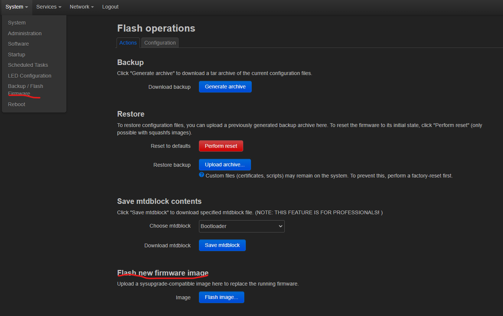

# Xiaomi Redmi AC2100 刷机指北

如果没有特殊需求，请不要随便刷机，刷机有风险！！刷机有风险！！刷机有风险！！

刷机原因：

1. 校园网客户端
2. 限制广告
3. airport...

网络上有大量教程但感觉有些过时，有些还有大坑，为避免大家重蹈覆辙，我记录下整个刷机过程供大家参考:）

## 刷入Breed

Breed是一个第三方的启动引导工具，刷入此工具后我们能够通过它再刷入不同的固件比如openwrt，padavan等。

刷入步骤：

1. 下载固件
2. 降级当前路由器固件（可选）
3. 利用漏洞获取ssh
4. 刷入breed
5. reset重启进入breed恢复后台

### 1. 下载对应固件

[点击下载 ac2100 breed](https://breed.hackpascal.net/breed-mt7621-xiaomi-r3g.bin)

### 2. 降级路由器当前固件

为了将breed固件写入路由器，我们需要上传固件并且烧写，这需要登录进路由器，低版本的固件存在一些漏洞（2.0.7）。

在路由器管理页面手动降级到对应[版本固件 点击下载](./assets/2.0.7/miwifi_rm2100_firmware_d6234_2.0.7.bin)后，等待重启。

### 3. 开启ssh

降级完成后再次登录管理界面，登录的url大致是这样的：

```url
// ip可能会不一样，<stok>是一长串字符每次登录后都不一样
http://192.168.31.1/cgi-bin/luci/;stok=<STOK>/web/home#router
```

使用下述代码进行注入，将`<stok>`替换为浏览器地址栏显示的值后再输入进地址栏

```url
http://192.168.31.1/cgi-bin/luci/;stok=<STOK>/api/misystem/set_config_iotdev?bssid=Xiaomi&user_id=longdike&ssid=-h%3B%20nvram%20set%20ssh_en%3D1%3B%20nvram%20commit%3B%20sed%20-i%20's%2Fchannel%3D.*%2Fchannel%3D%5C%22debug%5C%22%2Fg'%20%2Fetc%2Finit.d%2Fdropbear%3B%20%2Fetc%2Finit.d%2Fdropbear%20start%3B
```

执行完成后会出现`{"code":0}`

退出再刷新浏览器重新进入管理界面，此时`<stok>`会发生变化，再通过下述代码修改root密码：

```url
http://192.168.31.1/cgi-bin/luci/;stok=<STOK>/api/misystem/set_config_iotdev?bssid=Xiaomi&user_id=longdike&ssid=-h%3B%20echo%20-e%20'admin%5Cnadmin'%20%7C%20passwd%20root%3B
```

此时能够使用ssh登录进路由器，账号为：root 密码为：admin

### 4. 刷入breed

ssh登录路由器后，将第一步得到的固件上传到路由器`/tmp`目录后执行下述代码：

```shell
mtd -r write /tmp/breed-mt7621-xiaomi-r3g.bin Bootloader
```

### 5. 进入breed控制台

如果电脑重新获取到IP后说明刷写完成并且breed引导了官方固件，断电。按住reset键（背面圆孔，用取卡针插进去）后插电等待system的蓝灯闪烁后松开reset键。

用浏览器访问`192.168.1.1`进入breed恢复界面，更改环境变量，新增字段"xiaomi.r3g.bootfw", 值设置为 2,然后保存。

点击固件更新即可上传自己的固件。

## 刷入OpenWRT

准备OpenWRT的[固件 点击下载](https://downloads.openwrt.org/releases/21.02.2/targets/ramips/mt7621/openwrt-21.02.2-ramips-mt7621-xiaomi_redmi-router-ac2100-initramfs-kernel.bin)，也可以找其他的版本，通过breed上传该固件，点击更新并等待路由器重启，这里建议用有线连接电脑，测试时该固件烧入后不会开启WIFI。


烧写完成后breed将会引导OpenWRT，如果要进入恢复控制台按照上述`进入breed控制台`操作即可。

## 刷入升级包

OpenWRT烧写完成后用浏览器访问`192.168.1.1`进入管理界面，默认无密码。



点击导航栏的[`System`的`Backup/Flash Firmware 点击跳转`](http://192.168.1.1/cgi-bin/luci/admin/system/flash)点击最下方的Flash image刷入[升级包](https://downloads.openwrt.org/releases/21.02.2/targets/ramips/mt7621/openwrt-21.02.2-ramips-mt7621-xiaomi_redmi-router-ac2100-squashfs-sysupgrade.bin)，等待重启。

在[Network中点击Wireless 点击跳转](http://192.168.1.1/cgi-bin/luci/admin/network/wireless)启用WIFI


上述使用的是官方提供的固件，这个是网络上找到的[升级固件](./assets/sysupgrade/openwrt-ramips-mt7621-xiaomi_redmi-router-ac2100-squashfs-sysupgrade.bin)，该固件提供了许多功能比如广告清理，ssr等，不想折腾可以直接使用这个升级固件。

## 安装插件

通过opkg工具在命令行中安装插件，有些插件存在依赖，在安装前建议执行：

```shell
opkg update
```

### scutclient

这是某学校的有线网连接[客户端](https://github.com/scutclient/scutclient):(，没有提供编译好的package得手动编译，如果不想编译可以[点击下载](./assets/ipk/scutclient_3.1.3-1_mipsel_24kc.ipk)，但是得架构和版本一致才能直接安装。

```txt
$ cat /etc/openwrt_release
DISTRIB_ID='OpenWrt'
DISTRIB_RELEASE='21.02.1'
DISTRIB_REVISION='r16325-88151b8303'
DISTRIB_TARGET='ramips/mt7621'
DISTRIB_ARCH='mipsel_24kc'
DISTRIB_DESCRIPTION='OpenWrt 21.02.1 r16325-88151b8303'
DISTRIB_TAINTS=''

```

如果不一样就手动编译:)

按照文档给的步骤得先准备SDK，OpenWRT的版本有很多得找到符合当前目标的SDK才行，[在这找到对应版本](https://downloads.openwrt.org/)。根据DISTRIB_RELEASE和DISTRIB_TARGET找到对应[SDK](https://downloads.openwrt.org/releases/21.02.1/targets/ramips/mt7621/)


按照步骤进行编译：

```shell
wget https://downloads.openwrt.org/releases/21.02.1/targets/ramips/mt7621/openwrt-sdk-21.02.1-ramips-mt7621_gcc-8.4.0_musl.Linux-x86_64.tar.xz

tar -Jxvf openwrt-sdk-21.02.1-ramips-mt7621_gcc-8.4.0_musl.Linux-x86_64.tar.xz

cd openwrt-sdk-21.02.1-ramips-mt7621_gcc-8.4.0_musl.Linux-x86_64/
mkdir package/scutclient
cp {SCUTCLIENT_SRC_DIR}/openwrt/Makefile package/scutclient

make defconfig
make package/scutclient/compile V=s
```

生成的文件存放在`bin`目录下:


上传到路由器使用`opkg install`安装即可。


### OpenClash

### V2ray

## 参考

[恩山大佬提供的开启SSH方法](https://www.right.com.cn/forum/thread-4032490-1-1.html)

